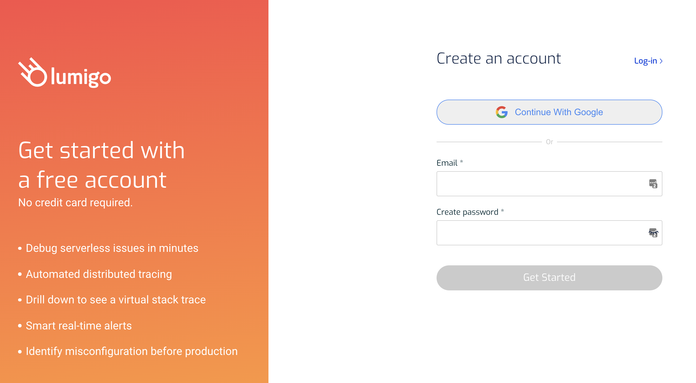
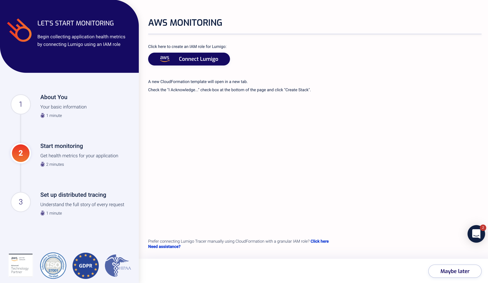
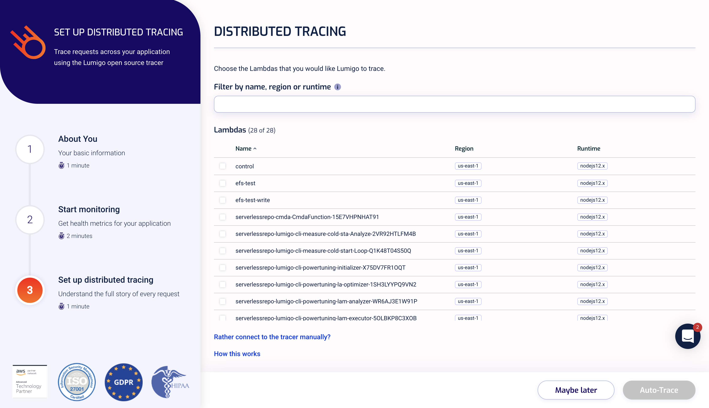

# Application Observability
In this module, you will integrate [Lumigo](https://lumigo.io) with your Stackery application.

## Instructions

### 1. Update the application 
In this step, we will use a more complex serverless application. To deploy it, switch to the `monitoring` branch of this repository:

```bash
cd ../wild-rydes-workshop/
git fetch
git checkout monitoring
cd ..
```

Now copy the content over to your local application:

```bash
rm -r stackery-wild-rydes/src
cp -a wild-rydes-workshop/src stackery-wild-rydes/src
```
```bash
cp wild-rydes-workshop/template.yaml stackery-wild-rydes/template.yaml
```

You'll now deploy the updated *stackery-wild-rydes* stack:

```bash
stackery deploy -e production --aws-profile <your-aws-profile-name>
```

This will again take a few minutes.

### 2. Integrate Lumigo
Next, let's integrate Lumigo to our application. To get started with Lumigo, take the following steps. A more detailed guide can be found at [the Lumigo documentation](https://docs.lumigo.io/docs/create-an-account).

#### Create an Lumigo account
Click on the link below to bring you to the Lumigo signup page.

* [Create an Lumigo Account](https://platform.lumigo.io/signup)

#### Tell us a bit about yourself
Once you created your account, Lumigo will guide you through the integration. First, fill in some details:


#### Link Lumigo to your AWS account
Next, we will link Lumigo to our AWS account. To do so all that is required is deploying our CloudFormation stack to your account. A more detailed walkthrough of this step can be found [here](https://docs.lumigo.io/docs/connect-your-environment).



### Integrate Lumigo with Auto-Tracing
Next, you should land at the instrumentation step, which will let us trace our functions:



Lumigo will automatically start monitoring your application. Order some unicorn rides, and let's see what's going on in Lumigo!

### 3. View your application
Lumigo will trace the invocations of your application. The first thing we will use it for is to get an understanding of how our application looks in real life.

Click on the [System map](https://platform.lumigo.io/system-map) to have an overview of your application's architecture:


Explore the different functions' stats and invocations in your account using the [Functions](https://platform.lumigo.io/functions) page:


## Next Steps
Proceed to the next module in this workshop:

* [Troubleshooting & Distributed Tracing](07-troubleshooting-distributed-tracing.md)
