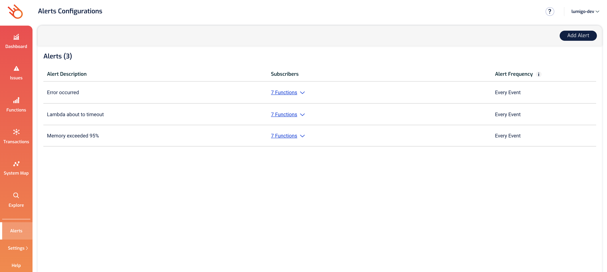
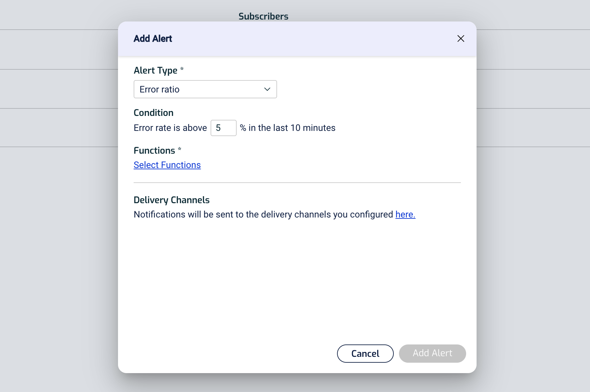
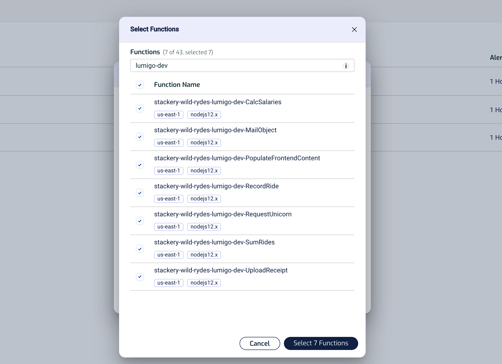
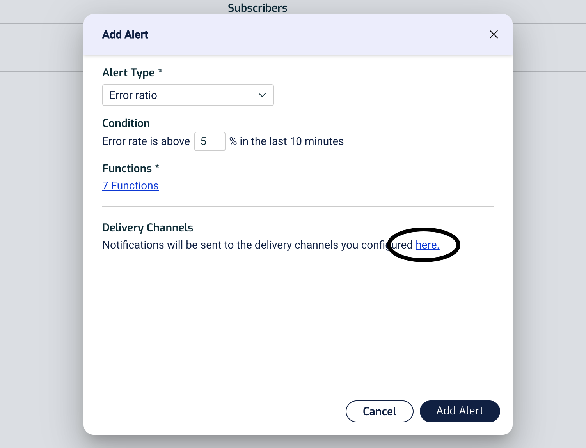
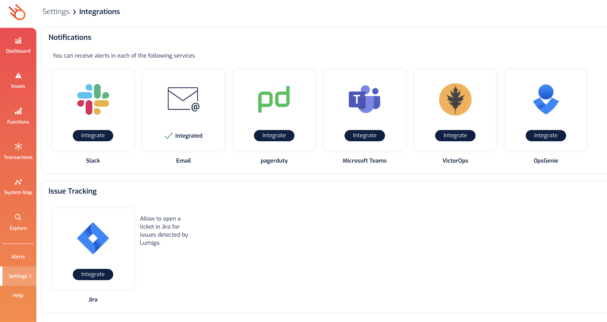

# Monitoring
In this module, we will set up monitoring for our application.

## Instructions
### 1. Configure alerts for your application
To be able to react to issues in your application quickly, you can configure alerts for your application.

If you go to the [Alerts](https://platform.lumigo.io/alerts-configurations) page, you can see that Lumigo has configured a couple of default alerts.

By virtual of enabling auto-trace on our functions, our functions have been configured with these default alerts.

But wait, right now, we're alerted every time something goes wrong. That's a bit too much. Let's dial it down a notch and set up the alerts so that we receive a maximum of one alert every hour.

Click on each of the alerts and change the `Alert Frequency` in the dialogue to `1 Hour`. Don't forget to click `Save Alert` when you're done.

### 2. Configure new alerts

Let's add another alert, click the `Add Alert` button on the top right.

In the new dialogue, choose `Alert Type` as `Error Ratio` and set the percentage to 5%.

Next, select the 7 functions we have.

Finally, we have to choose how we want to be notified. If you follow the `here` link below...

you will arrive at the [Integrations](https://platform.lumigo.io/integrations) page where you can integrate with other vendor software you might be using already.

Finally, click `Add Alert` to finish the process.

### 3. Trigger an error in the application
Go back to the app, request a bunch of unicorns like you did earlier. You should see lots of `Unicorn not available` error messages.

And sure enough, a short while later you will receive an alert via the medium you configured:

## Next Steps

Proceed to the next module in this workshop:

* [Performance Monitoring](09-performance-monitoring.md)
