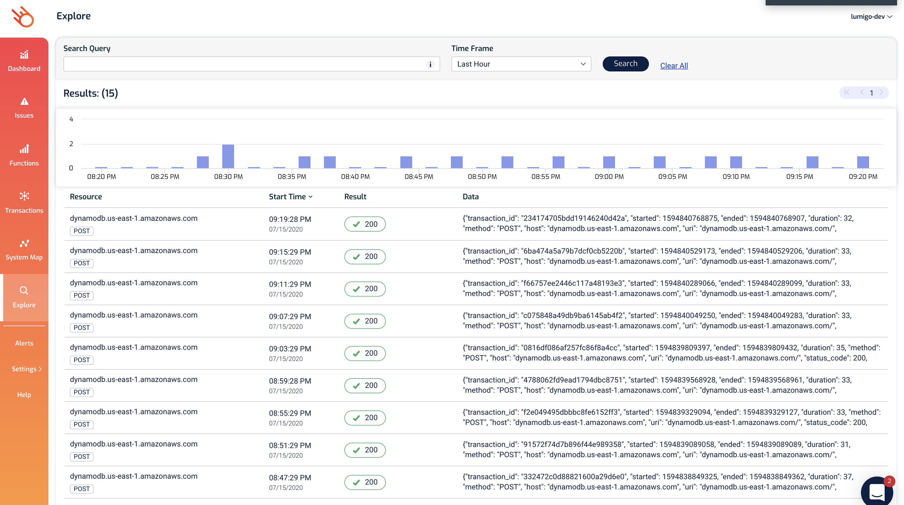

# Performance Monitoring
In this module, we will learn how to monitor the performance of our application and will also troubleshoot some Lambda-specific issues that can occur in your system.

## Instructions
### 1. Request 10 Unicorn rides
This will trigger our application.

### 2. Find the issue with the application
There is another issue with the application, let's find it!

Go to the [Transactions](https://platform.lumigo.io/transactions) page. Once again, toggle the `Transactions with issues only` button and hit `Filter`.

Looks like the `CalcSalaries` function has been timing out.

Another way to quickly find issues in your system is to go to the [Issues](https://platform.lumigo.io/issues) page.

We already dealt with the `TypeError` problem with the `UploadReceipt` function, so let's click on the `CalcSalaries` function to see why it's timing out.

This takes us to the function details page where we can see that it's got a fair few timeouts over the last few hours.

Click on one of the transactions in the list (which is already filtered with the `TimedOut` error since we navigated here through the issues page) takes us to the [Transactions](https://platform.lumigo.io/transaction) view.

As you can tell from the logs on the right, it's been retried twice already, and all three attempts timed out after 6s.

Click on the `Timeline` tab above the graph would tell us what happened.

Here we can see the timeline for all three invocations, and notice that there's a HTTP request to `http://hzi3xi7agi.execute-api.us-east-1.amazonaws.com/` which is marked as `N/A` for its duration?

This is how Lumigo represents an unfinished HTTP request because the function timed out.

Click on that row to see more information about it, and you can see that the request to `https://hzi3xi7agi.execute-api.us-east-1.amazonaws.com/development/unicorn/Norman` never completed and that's why our function timed out (3 times!).

### 3. Explore
Lumigo lets you explore and query all the data that they record on your system. If you go to the [Explore](https://platform.lumigo.io/search) page you can see the datat Lumigo has recorded.

If you want to find other things that are slow (e.g. taking more than 500ms) then you can use a flexible query language to explore all the data Lumigo has for your application.

For example, try entering the query `duration: >500` in the `Search Query` box and hit `Search`. You might see something like this:

Here, you can see the `CalcSalaries` invocations that timed out, but you can also see successful operations that were just a bit slower than you'd like.

Take the top row on `hzi3xi7agi.execute-api.us-east-1.amazonaws.com` for instance. If you click on the row to expand it, you can see that this HTTP request took a whole 4 second to complete!

If you click on the hyperlinked resource name it'll take you to the [Transactions](https://platform.lumigo.io/transactions) view of the transaction that HTTP request was part of.

You can see that this slow HTTP request was part of the `CalcSalaries` function. From the logs you can see it timed out the first time, but then succeeded on retry, although the retry also took over 5s.

Clicking on the `Timeline` tab shows me where the slow HTTP request comes in.

